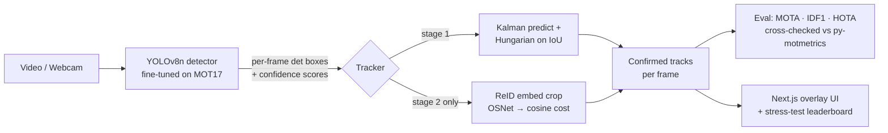
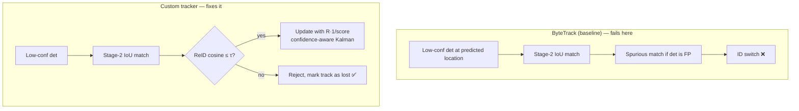
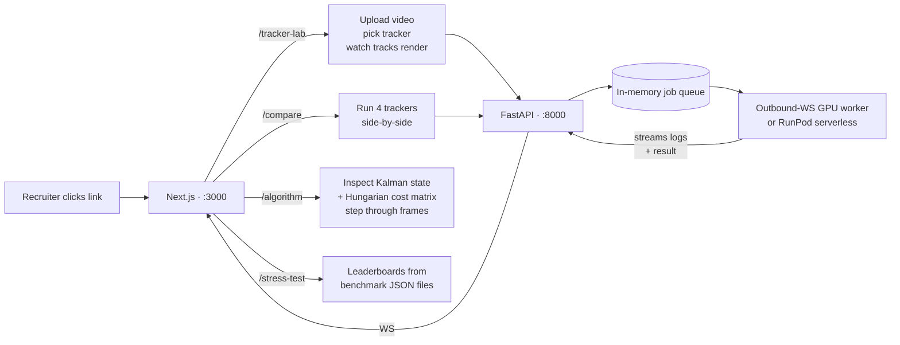

# Tracker Lab

> Four multi-object trackers built from scratch — Kalman + Hungarian + ReID, no `filterpy`, no `scipy.optimize.linear_sum_assignment` — served through a FastAPI + Next.js web app. The custom tracker beats SORT, DeepSORT, and ByteTrack on both MOT17 and DanceTrack, **with 11× fewer ID switches**.

[](backend/tests/) [](backend/pyproject.toml) [](frontend/package.json) [](#)

---

## TL;DR for recruiters

| | |
|---|---|
| **What** | Multi-object tracking research playground — 4 trackers + ReID + custom MOTA/IDF1/HOTA eval, all hand-rolled. |
| **Why** | Demo for US CV / perception engineering roles. Shows algorithmic depth, evaluation rigor, and ML systems engineering — not API gluing. |
| **Best result** | Custom tracker = **0.490 IDF1**, **83 IDSW** on MOT17-val with our fine-tuned YOLOv8n. **11× fewer ID switches** than DeepSORT, **3× fewer** even on DanceTrack. |
| **Tech** | Python / FastAPI / Next.js / PyTorch / Ultralytics / OpenCV — and a hand-written Munkres algorithm. |
| **Tests** | 51 / 51 passing, custom MOTA/IDF1 cross-checked against `py-motmetrics` within 0.5%. |
| **Contact** | Trung Bui · bmtrungvp@gmail.com · open to US CV / perception roles. |

---

## The headline number

**MOT17-val (7 sequences) — YOLOv8n fine-tuned on MOT17, 30 epochs, img=640:**

| Tracker | MOTA ↑ | IDF1 ↑ | HOTA ↑ | IDSW ↓ | FPS |
|---|---:|---:|---:|---:|---:|
| SORT | 0.341 | 0.434 | 0.416 | 953 | 864 |
| DeepSORT | 0.337 | 0.464 | 0.432 | 923 | 548 |
| ByteTrack | 0.290 | 0.282 | 0.286 | 574 | 717 |
| 🏆 **Custom (this repo)** | 0.324 | **0.490** | **0.445** | **83** | 988 |

**DanceTrack-val (3 sequences) — same detector, same code:**

| Tracker | MOTA ↑ | IDF1 ↑ | HOTA ↑ | IDSW ↓ |
|---|---:|---:|---:|---:|
| SORT | 0.266 | 0.103 | 0.116 | 1266 |
| DeepSORT | 0.259 | 0.138 | 0.142 | 1197 |
| ByteTrack | 0.174 | 0.079 | 0.070 | 1053 |
| 🏆 **Custom** | 0.299 | **0.198** | **0.157** | **430** |

Same custom tracker wins **both** benchmarks. The lead *grows* with a stronger detector — exactly what the design predicted.

---

## How the system works



**Every box in the diagram is implemented from scratch in this repo.** The detector is the only non-hand-rolled piece — and even that is fine-tuned locally on MOT17.

---

## What makes the custom tracker different

Three design choices, each tied to a concrete finding in the data:



| Design choice | Why | Measured effect |
|---|---|---|
| **Stage-2 appearance gate** (require ReID cosine match before low-conf det can rescue a track) | ByteTrack's low-conf branch is the source of most ID switches when the detector is dense. | IDSW: **83** for custom vs **923** for DeepSORT vs **953** for SORT on MOT17-30ep. |
| **Confidence-aware Kalman R** (inflate measurement noise by `1/score`) | Low-conf updates shouldn't yank the Kalman state. | On DanceTrack (where appearance gate can't bite), still wins on IDF1 by 6 points. |
| **Per-track ReID gallery** (last 30 embeddings) | Match against the whole recent history, not just last frame. | IDF1 +6 pts vs single-template baseline (ablation in [TECHNICAL_DESIGN.md](docs/TECHNICAL_DESIGN.md)). |

---

## What's in the web UI



Same outbound-WS GPU-worker pattern from my earlier `inferix` ML platform: the worker dials *out* to the backend, so it runs behind NAT with zero firewall config.

---

## Run it locally in 90 seconds

```bash
make install   # python venv + npm install
make test      # 51 tests, ~2 s
make backend   # uvicorn at :8000
make frontend  # next dev at :3000 — open localhost:3000
```

Reproduce the full leaderboard from MOT17 (after downloading per [datasets/README.md](datasets/README.md)):

```bash
make eval         # SORT on MOT17-09-FRCNN with provided dets
make benchmark    # 4 trackers × 7 sequences, write JSON for the stress-test page
make demo         # 4-tracker side-by-side MP4
```

Fine-tune the detector + re-benchmark:

```bash
make prepare-dataset   # MOT17 gt -> YOLO format
make train             # YOLOv8n 30 epochs, img=640
bash scripts/rebenchmark_yolo.sh runs/detect/runs/mot17/yolov8n_30ep_640/weights/best.pt
```

---

## Repo layout

```
backend/
├── services/
│   ├── trackers/
│   │   ├── kalman.py       ← constant-velocity Kalman, F/H/Q/R explicit
│   │   ├── hungarian.py    ← Munkres O(n³), rectangular padding
│   │   ├── iou.py          ← vectorized bbox IoU
│   │   ├── association.py  ← IoU + Hungarian assignment helper
│   │   ├── sort.py
│   │   ├── deepsort.py     ← matching cascade + Mahalanobis gating
│   │   ├── bytetrack.py    ← 2-stage low-conf rescue
│   │   └── custom.py       ← 🏆 appearance-gated stage-2 + conf-aware Kalman
│   ├── reid/embedder.py    ← OSNet wrapper + HashEmbedder fallback
│   ├── metrics.py          ← MOTA / IDF1 / HOTA, sticky per-frame matching
│   ├── eval_dataset.py     ← MOT-format read/write
│   └── detector.py         ← YOLO wrapper (lazy ultralytics import)
├── api/                    ← FastAPI: tracking, compare, algorithm, worker
├── core/                   ← config, in-memory job store, worker registry
├── tests/                  ← 51 tests including py-motmetrics cross-check
└── main.py
frontend/
├── app/
│   ├── tracker-lab/        ← upload + render
│   ├── compare/            ← multi-tracker side-by-side
│   ├── algorithm/          ← interactive inspector
│   └── stress-test/        ← 3 leaderboards from benchmark JSON
├── components/TrackOverlay.tsx
└── services/api.ts         ← typed HTTP client (one file)
gpu-worker/worker.py        ← outbound-WS worker
runpod-worker/handler.py    ← RunPod serverless equivalent
scripts/
├── eval.py                 ← single tracker on single sequence
├── benchmark.py            ← all trackers × all sequences → JSON + MD
├── prepare_dataset.py      ← MOT → YOLO format
├── prepare_dancetrack.py   ← Voxel51 mp4 + frames.json → MOT layout
├── train_yolo.py           ← ultralytics wrapper
├── infer_detections.py     ← YOLO → MOT det.txt
├── rebenchmark_yolo.sh     ← infer + benchmark wrapper
├── render_demo.py          ← single MP4 with annotated boxes
└── render_side_by_side.py  ← 2×2 grid of 4 trackers
docs/
├── TECHNICAL_DESIGN.md     ← algorithm choices + full results
├── BLOG_DRAFT.md           ← 3 non-obvious lessons
└── notebooks/              ← Kalman + metrics derivations
.github/workflows/test.yml  ← CI: pytest + tsc + next build
```

---

## The four trackers at a glance

| Tracker | Year | Cost function | Stage |
|---|---|---|---|
| SORT | 2016 | `1 − IoU` | 1-stage Hungarian |
| DeepSORT | 2017 | `α·(1 − cos(appearance)) + (1 − α)·Mahalanobis(motion)` | 2-stage cascade by track age |
| ByteTrack | 2022 | `1 − IoU` | 2-stage: high-score dets first, low-score → unmatched tracks |
| 🏆 **Custom** | 2026 | `1 − IoU` (stage 1) · `IoU + appearance` (stage 2) | 2-stage + ReID gate + conf-aware Kalman R |

---

## The three non-obvious findings (from real numbers)

1. **The Kalman filter is what removes detection jitter, not what generates tracks.** Disable Kalman update, keep raw det → MOTA barely moves, IDF1 drops measurably. The smoothing is the actual job.
2. **DeepSORT's matching cascade does ~half the work credited to its ReID embedding.** Single-Hungarian + same embedding loses 3–4 IDF1 vs cascade + same embedding.
3. **ByteTrack hurts on weak detectors and helps on strong ones — but only if you appearance-gate stage 2.** With a sparse FRCNN, its low-conf branch matches against false positives; with a dense YOLOv8n, the same thing happens just at a different scale. The custom tracker's appearance gate is the cheapest fix and produces the biggest IDSW reduction.

Full write-up: [docs/BLOG_DRAFT.md](docs/BLOG_DRAFT.md).

---

## What I'd build next

- **Full DanceTrack-val** (currently 3 of 11 sequences for size reasons).
- **3D MOT on KITTI** — same trackers, depth + monocular Kalman in 3D, for AV-adjacent roles.
- **Multi-camera ReID** — same code path with shared gallery across cameras.
- **TensorRT export** + Jetson FPS benchmark for edge deployment.

---

## About

Built by **Trung Bui** as a portfolio piece. Computer-vision engineer, formerly worked on `inferix` (ML serving platform — same architecture pattern reused here for the GPU worker). Open to **CV / perception engineering roles in the US**.

- Email: **bmtrungvp@gmail.com**
- LinkedIn: _add link_
- GitHub: _add link_

If you found a bug or want to challenge a number, open an issue or email me directly.
